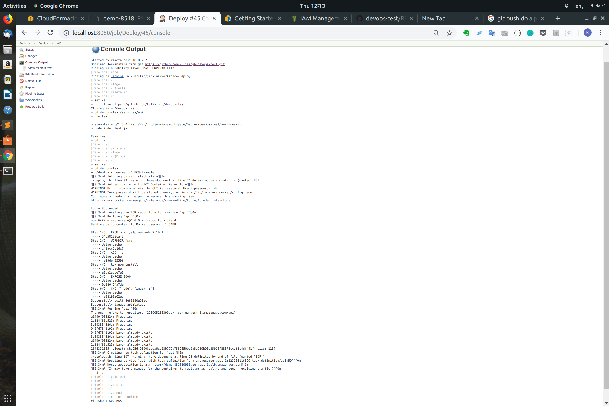
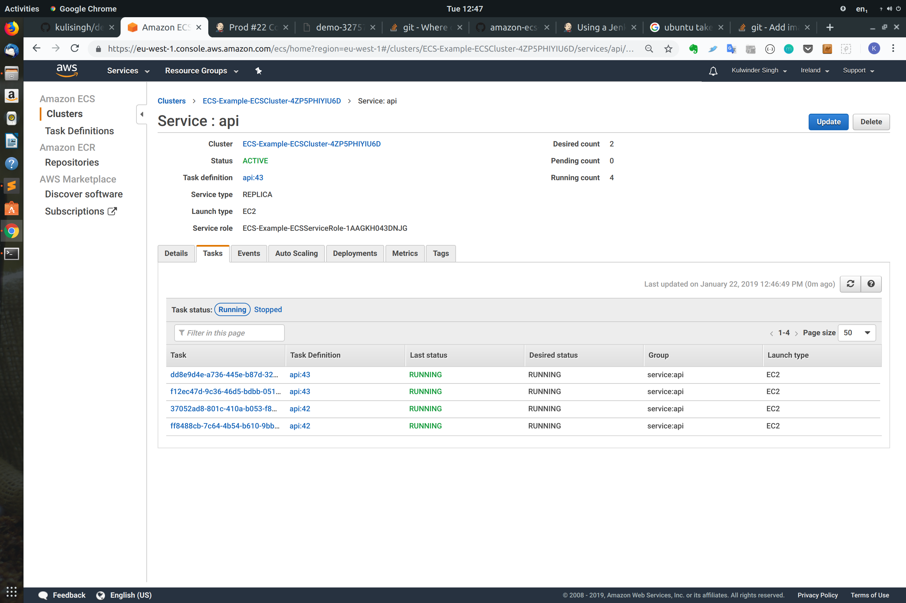

# DevOps Engineer - Technical Test	

## NOTE: Please see the notes on my solution below - KS

We think infrastructure is best represented as code, and provisioning of resources should be automated as much as possible.	

 Your task is to create a CI build pipeline that deploys this web application to a load-balanced	
environment. You are free to complete the test in a local environment (using tools like Vagrant and	
Docker) or use any CI service, provisioning tool and cloud environment you feel comfortable with (we	
recommend creating a free tier account so you don't incur any costs).	

 * Your CI job should:	
  * Run when a feature branch is pushed to Github (you should fork this repository to your Github account). If you are working locally feel free to use some other method for triggering your build.	
  * Deploy to a target environment when the job is successful.	
* The target environment should consist of:	
  * A load-balancer accessible via HTTP on port 80.	
  * Two application servers (this repository) accessible via HTTP on port 3000.	
* The load-balancer should use a round-robin strategy.	
* The application server should return the response "Hi there! I'm being served from {hostname}!".	

 ## Context	
We are testing your ability to implement modern automated infrastructure, as well as general knowledge of system administration. In your solution you should emphasize readability, maintainability and DevOps methodologies.	

 ## Submit your solution	
Create a public Github repository and push your solution in it. Commit often - we would rather see a history of trial and error than a single monolithic push. When you're finished, send us the URL to the repository.	

 ## Running this web application	
 This is a NodeJS application:	This is a NodeJS application:

- `npm test` runs the application tests	- `npm test` runs the application tests
- `npm start` starts the http server

## KS Solution

I created the solution as follows, after doing a bit of research to understand ECS (as it has been a while):

* Used local Jenkins CI server running in vagrant, which was provisioned using ansible in the past.  The intention was to use this against an ECS Cluster on using my AWS account
* I forked your devops-test project
* I used a great example which creates an ECS cluster using cloudformation and then has a script to deploys a docker container as a service with an Application Load Balancer - spent a lot of time familiarising with ECS and the cloudformation stack and deploy.sh script
   * Please see this link: _https://github.com/awslabs/amazon-ecs-nodejs-microservices/tree/master/2-containerized_
* I adapted this locally to use your example
* I combined this code and added it to my devops-test repo
* I added a rule.json file to ensure the deploy script creates a load balancer and target group, using the rule in the file
* I created a dockerfile to build the devops example as a container
* I created 2 separate jenkins projects:
  * Build project, to build the ECS infrastructure, running the following command:
     * _aws cloudformation deploy \
--template-file infrastructure/ecs.yml \
--region eu-west-1 \
--stack-name ECS-Example \
--capabilities CAPABILITY_NAMED_IAM
  * Deploy pipeline (added the Jenkinsfile to the repo too)
     * Test stage to run test npm on the command line
     * Prod stage to deploy to cluster if the test worked
* In order to get jenkins to work I had to do the following:
   * As my jenkins is localhost, I researched and ended up adding a git-commit githook which triggers my Prod jenkins job: _curl -u admin:<my api token> -X POST http://localhost:8080/job/Prod/build?token=apiToken_ 
   * I installed npm and docker on my vagrant jenkins server and added the docker group to the jenkins use, 
   * Now, If I change the app and push up, jenkins automatically starts, and ECS updates its tasks and eventually has a service with the new task version 

### Jenkins - update job running:

### ECS - note this is in transition between versions of the code...

## To Do

I didn't have time but I would also:
* Add proper error handling to the the shell scripts running in jenkins
* I made the triggered Prod deployment pipeline script a proper pipeline (where as the ECS build wasn't) so we could store the jenkinsfile in the repo and call it (rather than inline), but I didn't get round to it.  It is has been added to the repo for reference
* Add a test stage in the pipeline to run _npm test_ as a dependency before running the production job 

### Notes on the solution

The solution demonstrates the following devops principles:
* A high degree of automation: the base cloud environment, and the service which is deployed is all scripted using cloudformation and cli commands -> Infrastructure as code
* The code is fairly simple and easy to change
* CI/CD principles are exhibited - the Prod build is automatically triggered when changes are pushed up
* The target environment is load balanced across availability zones

### Notes on further improvemnts

With time I would demonstrate:

* Create multiple environment pipelines, maybe a dev to deploy just to a single docker container too
* Using a standardise process with different environment variables for each environment
* The above would allow the SDLC to run in a repeatable and consistent manner, ensuring that we have thoroughly tested the same code all the way to production (docker helps with this too)
* Have all the jenkins confiuguration as code too
